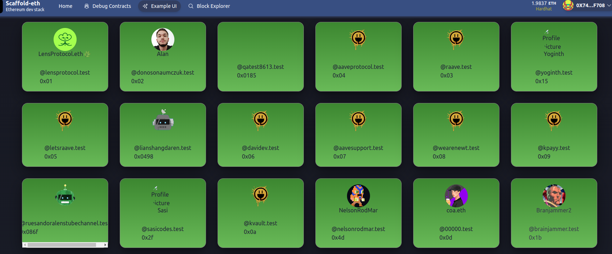
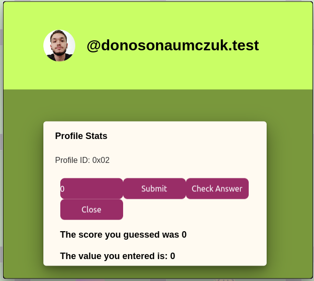

# Phala Network | LensAPI Oracle Challenge

## Profile Activity Score Predictor

1. Contract ID on PolygonMumbai of `Consumer Contract` : 0x0Bb9D9aDeeD862Df5Af831D3ADfa7D9CdfaF0a83
2. LensAPI Oracle Endpoint Address : 0x14f125ea7533bcfd0c78cf6f55f813515030b21e
3. My smart contract is at packages/hardhat/contracts/GameChoice.sol.


For this hackathon, we have tried to implement a profile activity score predictor. 

A Lens profile activity is calcualted by adding the "totalFollowers" and "totalFollowing" which is retireved from the LensAPI Oracle which is accessed through the PhatBricks portal.


The dapp works such that a user can sign into the dapp and at the UI page, they can see all the LENS profile in the page as shown for example:

Next, the user can click on any profile that they want to predict as below:

The user can put any score in the 1st box to the left and then click on submit. After clicking submit, the user can check on his score prediction by clicking on the "Check Answer" button. 

This is just a fun game to play and purely based on luck as there is no way anyone can predict a Lens profile account activity score just by given the profile id and profile picture information.

I was unable to complete the dapp as was stuck in the front end.


## Requirements

Before you begin, you need to install the following tools:

- [Node (v18 LTS)](https://nodejs.org/en/download/)
- Yarn ([v1](https://classic.yarnpkg.com/en/docs/install/) or [v2+](https://yarnpkg.com/getting-started/install))
- [Git](https://git-scm.com/downloads)

## Quickstart

To get started with Scaffold-ETH 2, follow the steps below:

1. Clone this repo & install dependencies

```
git clone https://github.com/scaffold-eth/scaffold-eth-2.git
cd scaffold-eth-2
yarn install
```

2. Run a local network in the first terminal:

```
yarn chain
```

This command starts a local Ethereum network using Hardhat. The network runs on your local machine and can be used for testing and development. You can customize the network configuration in `hardhat.config.ts`.

3. On a second terminal, deploy the test contract:

```
yarn deploy
```

This command deploys a test smart contract to the local network. The contract is located in `packages/hardhat/contracts` and can be modified to suit your needs. The `yarn deploy` command uses the deploy script located in `packages/hardhat/deploy` to deploy the contract to the network. You can also customize the deploy script.

4. On a third terminal, start your NextJS app:

```
yarn start
```

Visit your app on: `http://localhost:3000`. You can interact with your smart contract using the contract component or the example ui in the frontend. You can tweak the app config in `packages/nextjs/scaffold.config.ts`.

Run smart contract test with `yarn hardhat:test`

- Edit your smart contract `YourContract.sol` in `packages/hardhat/contracts`
- Edit your frontend in `packages/nextjs/pages`
- Edit your deployment scripts in `packages/hardhat/deploy`


## License

[MIT](LICENSE)